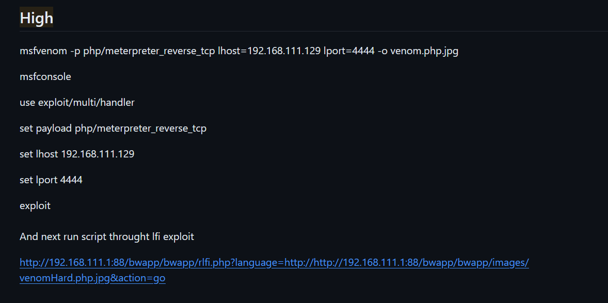

## Low difficulty
- just upload the php file and access it through URL
## Medium Difficulty
- change the extension of the php file(php4,php5 etc)
## High Difficulty
- i did not know how to do this so i have used my friends approach

