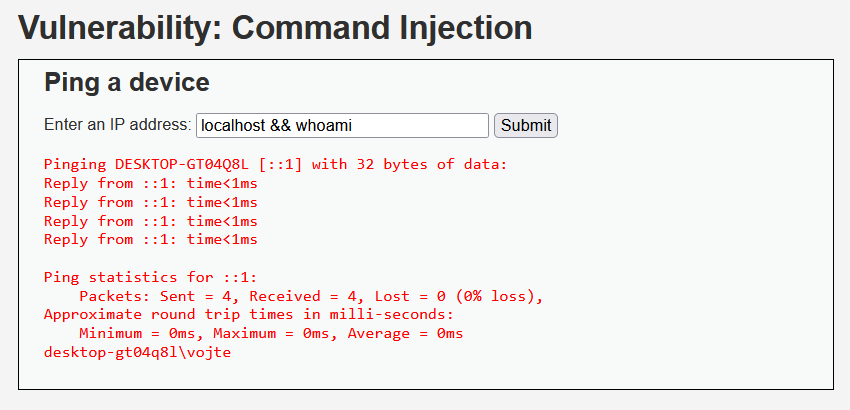
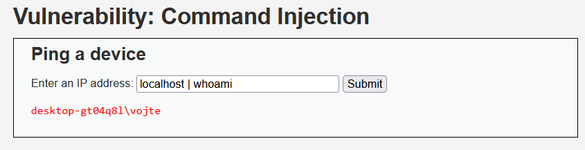
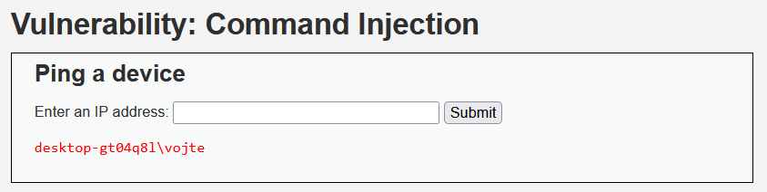

#Command Injection 
- Low security  
    - just tried && whoami
  
- Medium security  
  - had to look at source code to see how does the code handles operators, saw & and ; is "patched" so I tried different methods (|, ||) 
  
- High security  
  - have tried same tricks, looked at source again and didn't figure it out, so had to look up guide which pointed me on the "rogue" white space when filtering "|" == "| ", so I used that symbol without space

  
