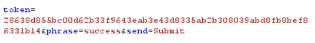
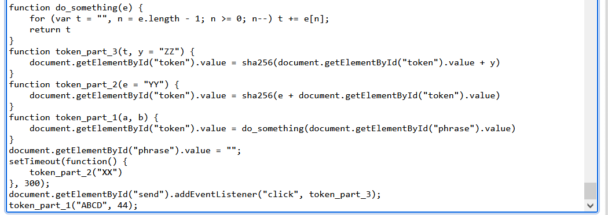
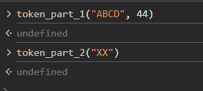

#JS vulnerability
- Security - High 
- token
  
- used online deobfuscation tool to clear JS code
  
- part 1 and 2 happens on load (and part 2 after 300ms delay), so we have to "redo" after we change the phrase
  
- after that click submit and well done! appears

